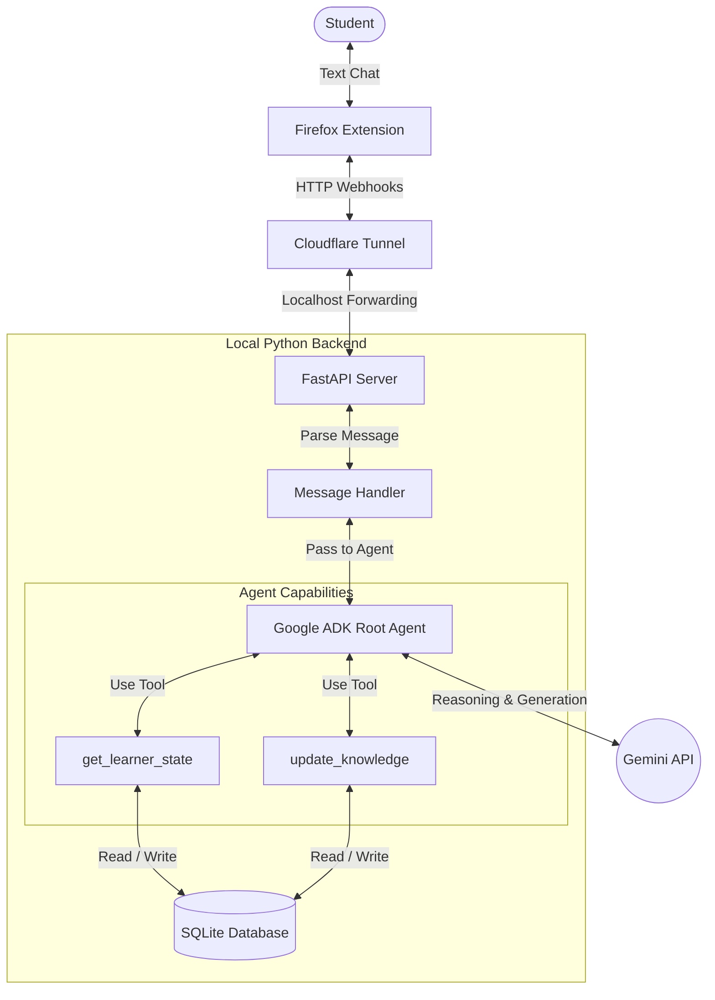

# Hackathon MVP Architecture Blueprint

This document outlines the structural "backbone" of the Learning Companion Agent tailored specifically for an 8-hour Hackathon. It cuts out the noise and focuses on the absolute essentials required to build a functional, impressive prototype.

## 1. System Architecture (Data Flow)

The system relies on a local server exposed to the internet via a secure tunnel, interacting with cloud AI APIs.



## 2. Core Technology Stack (The Frameworks)

- **Programming Language:** Python 3.10+
- **API Framework:** `FastAPI` + `Uvicorn` (Extremely fast to set up, built-in async support for handling chat webhooks).
- **Agent Framework:** `Google ADK` (Agent Development Kit). Handles the core ReAct (Reasoning + Acting) loop, tool binding, and LLM communication.
- **LLM Model:** Google Gemini (`gemini-1.5-flash` for high speed, or `gemini-1.5-pro` for deep reasoning).
- **Database:** `SQLite3` (Zero configuration, single-file database. Perfect for hackathons).
- **Networking/Tunnel:** `cloudflared` (Exposes local FastAPI port 8000 to a public HTTPS URL for Discord/Zalo to hit).

## 3. The Agent Design (The Brain)

We will use a **Single Root Agent** pattern.

- **System Prompt (Persona):** 
  *"You are a personal learning companion. Your goal is not just to give answers, but to understand what the user is trying to learn, check their current knowledge state, and guide them. If they struggle, change your explanation style (e.g., use an analogy or the Feynman technique)."*
- **State Management:** ADK will maintain the session history for the current conversation.
- **Tools (Functions given to the Agent):**
  1. `get_learner_profile(user_id)`: Fetches the user's current overall goal (e.g., "Learn Python").
  2. `check_knowledge_state(user_id, concept)`: Checks the DB to see if the user has mastered a concept.
  3. `update_knowledge_state(user_id, concept, mastery_level)`: Allows the AI to save (remember) that a user has learned something new.

## 4. Database Schema (The Memory)

Keep it bare-bones. Three simple tables in SQLite:

1. **`users`**
   - `id` (Primary Key, matches Discord/Zalo ID)
   - `learning_goal` (Text - e.g., "Become an AI Engineer")
   - `created_at` (Timestamp)

2. **`knowledge_state`**
   - `user_id` (Foreign Key)
   - `concept_name` (Text - e.g., "For Loops", "Transformer Models")
   - `mastery_score` (Integer 1-10)
   - `last_updated` (Timestamp)

3. **`chat_events`** (Optional, for logging/debugging)
   - `id` (PK)
   - `user_id`
   - `message`
   - `role` (user or agent)

## 5. Folder Structure (The Code Backbone)

This is how we will structure the Python project:

```text
Hackathon-T9-2026/
├── main.py                 # FastAPI app & Webhook endpoints
├── config.py               # Environment variables (API keys)
├── db/
│   ├── database.py         # SQLite connection & table setup
│   └── queries.py          # CRUD helper functions
├── agent/
│   ├── core_agent.py       # Google ADK agent initialization & prompt
│   └── tools.py            # The Python functions the AI can call
├── .env                    # Secrets (Gemini API key, Discord Token)
├── requirements.txt        # Python dependencies
└── docs/                   # Design & Planning documents
```

## 6. Development Phases (Actionable Steps)
1. **Phase 1: Setup:** Create virtual environment, install FastAPI, ADK, SQLite. Create `.env`.
2. **Phase 2: Database:** Write `db/database.py` to create the 2 tables.
3. **Phase 3: Tools:** Write `agent/tools.py` to read/write to the DB.
4. **Phase 4: Agent:** Write `agent/core_agent.py` to bind tools to the ADK agent.
5. **Phase 5: API:** Write `main.py` with a `/webhook` POST route.
6. **Phase 6: Expose & Connect:** Run `cloudflared`, paste the URL into Discord/Zalo. Talk to the bot!
