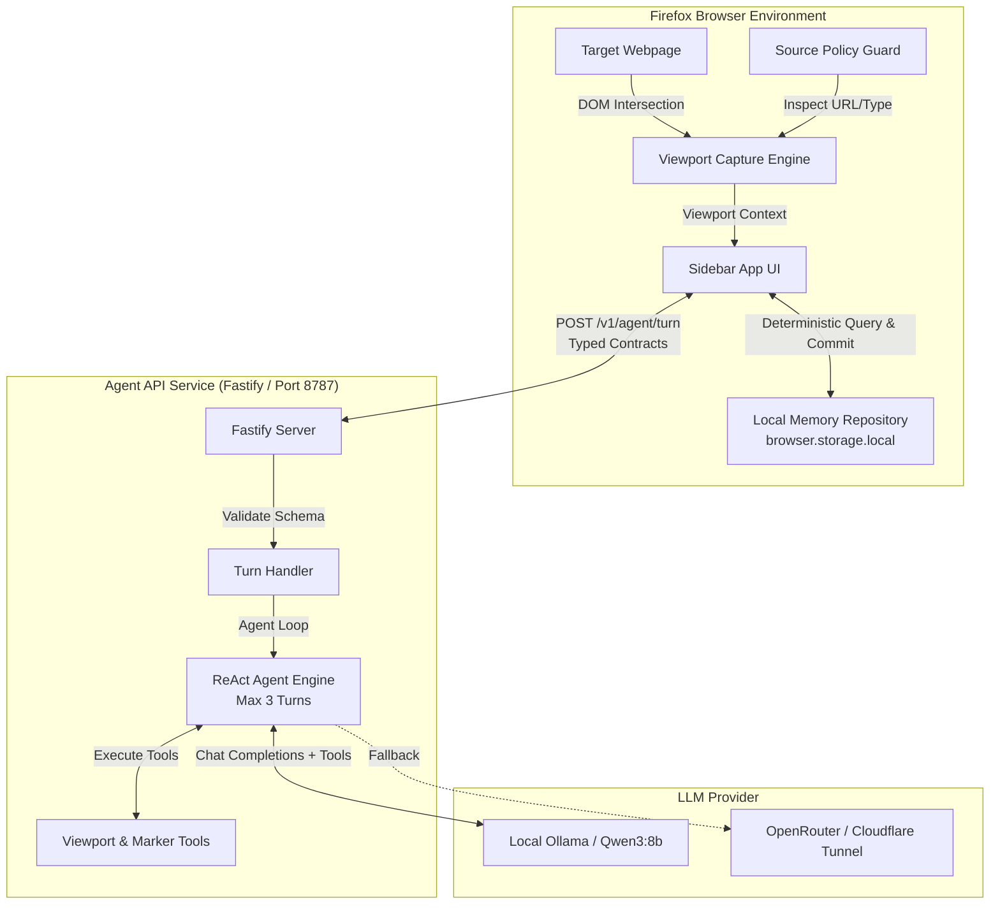

# Viewport Learning Companion (VLC)
> **AI Tinkerers Da Nang Hackathon — "Agents, Everywhere"**  
> *A Context-Aware, Local-First AI Learning Companion Inside the Web Browser*

---

## 1. Executive Summary

**Viewport Learning Companion (VLC)** is an intentional, privacy-preserving browser companion designed for students, developers, and lifelong self-learners. Instead of forcing learners to switch between articles and a detached chatbot window—or dumping entire web pages into an LLM—VLC sits directly inside a Firefox sidebar, observing **only what is currently visible on the screen (the viewport)**.

VLC bridges active reading with grounded AI assistance and local memory:
- **Instant Context Grounding:** Analyzes only the DOM text blocks intersecting the learner's active viewport (up to 4,000 characters), eliminating context pollution, token waste, and hallucinations.
- **Deterministic, Local-First Memory:** Allows learners to mark sections with comprehension tags (`Đã hiểu` / Understood, `Chưa hiểu` / Need Clarification, `Xem lại sau` / Review Later). Markers are saved directly in `browser.storage.local` and deterministically recalled whenever the learner scrolls back to that section.
- **Agentic Reasoning with Strict Human Oversight:** Powered by a ReAct agent loop (supporting local Ollama models like `qwen3:8b` or cloud-hosted OpenAI-compatible LLMs) that provides grounded answers with explicit citations. The agent can suggest knowledge updates, but state modifications strictly require human confirmation.
- **Zero-Surveillance Privacy:** No passive background tracking, no reading of unviewed text, and automatic blocking of sensitive platforms (PDFs, YouTube, webmail, social feeds, and private chats) before DOM capture occurs.

---

## 2. Problem Statement & Opportunity

### The Dilemma of Modern Digital Learning

1. **Context Blindness & Interaction Friction:**  
   When learners struggle with complex documentation, research papers, or tutorials, copying and pasting text into separate chat windows breaks flow state and strips out spatial context.
2. **Context Window Bloat & Hallucination:**  
   Most browser AI extensions dump entire web page DOMs or indiscriminately scrape whole articles. This floods the LLM context window with navigation menus, footers, advertisements, and irrelevant paragraphs, causing hallucinations and high inference latency.
3. **The "Passive Reading Illusion":**  
   Scrolling through an article does not equal comprehension. Learners frequently forget confusing sections or falsely assume they understand difficult concepts. Existing solutions either provide zero memory or implement intrusive background surveillance that records every URL visited without meaningful comprehension tracking.

### The VLC Solution

VLC transforms reading into an active, verified learning loop:
```text
Learner scrolls to confusing section
  ↓
Opens Sidebar (Active intent)
  ↓
Extension captures exact visible viewport (< 4,000 chars)
  ↓
Deterministic Matcher checks browser.storage.local
  ↓
Surfaces prior notes/markers on this exact section (Zero LLM cost)
  ↓
Learner asks a question → Agent loop reasons on grounded viewport
  ↓
Learner explicitly marks: [Đã hiểu] / [Chưa hiểu] / [Xem lại sau]
  ↓
Locally saved with DOM fingerprint for future recall
```

---

## 3. Key Features

### 👁️ Viewport-Accurate Context Capture
- Uses DOM layout coordinates (`getBoundingClientRect` against `window.innerHeight`) to extract only the text blocks actively visible to the human eye.
- Clamps captured context to a maximum of 4,000 characters, focusing the LLM strictly on the paragraph, diagram caption, or code snippet in front of the user.

### 🧠 Deterministic Local Memory & Auto-Recall
- Stores structured markers (`MemoryMarker`) in `browser.storage.local` indexed by URL path and content fingerprint.
- Whenever the sidebar opens, VLC deterministically retrieves up to 5 matching markers for that section without calling an LLM, showing past questions, notes, and mastery status.
- Revision tracking: Re-marking a section increments the revision count rather than duplicating data.

### 🤖 Grounded ReAct Agent Loop
- Runs up to a 3-step agentic loop against an OpenAI-compatible API (optimized for local `qwen3:8b` via Ollama or remote cloud models).
- Equipped with specialized read-only tools to inspect viewport context and propose action markers.
- Responses strictly enforce grounding: answers must cite specific phrases from the captured viewport text.

### 🛡️ Privacy by Design & Safe Client Policy
- Client-side **Source Policy Filter**: Rejects restricted content (PDFs, video players like YouTube, social media feeds, private messaging, webmail, banking) *before* any DOM access or API request is made.
- **Zero Background Telemetry**: Never monitors scroll events or tab switches in the background. Operates purely on explicit user invocation.
- **Stateless Backend**: The agent server does not retain user conversation data, browsing history, or markers. All long-term state remains in the learner's browser.
- **No Client Secrets**: API keys and model configurations reside solely on the backend.

---

## 4. System Architecture

VLC is built as a clean, modular TypeScript monorepo with strict boundary separation:



### Monorepo Structure

| Package / App | Path | Responsibility |
|---|---|---|
| **`@vlc/firefox-extension`** | `apps/firefox-extension` | Manifest V2 WebExtension, content scripts, sidebar UI, DOM viewport intersection, client policy guard. |
| **`@vlc/agent-api`** | `apps/agent-api` | Lightweight Fastify service, Zod contract validation, multi-turn ReAct agent loop, tool dispatch. |
| **`@vlc/contracts`** | `packages/contracts` | Shared TypeScript interfaces, types, and Zod schemas (`AgentTurnRequest`, `AgentTurnResponse`, `ViewportContext`, `MemoryMarker`). |
| **`@vlc/memory`** | `packages/memory` | Local storage repository abstraction on `browser.storage.local` with deterministic fingerprinting and matching. |

---

## 5. Technology Stack

- **Browser Environment:** Mozilla Firefox (Manifest V2, Sidebar API, `browser.storage.local`)
- **Frontend & Bundling:** Vanilla TypeScript, CSS3, Vite, `vite-plugin-web-extension`, `web-ext`
- **Backend Service:** Node.js (v22+), Fastify, TypeScript, `tsup`
- **Agent Framework & Inference:** Native ReAct loop over OpenAI-compatible Chat Completions API with Tool Calling (Local Ollama `qwen3:8b`, OpenRouter, Cloudflare Tunnel)
- **Data Validation & Typing:** Zod, Strict TypeScript
- **Testing & Quality Assurance:** Vitest, ESLint, `web-ext lint`

---

## 6. Hackathon Alignment: "Agents, Everywhere"

| Judging Criterion | How VLC Excels |
|---|---|
| **Contextual Placement** | Lives inside the web browser where actual digital reading and self-study happen, rather than an isolated tab or external app. |
| **Agentic Behavior** | Dynamically perceives its environment (live viewport DOM), executes reasoning loops, queries contextual tools, and formulates grounded responses and action proposals. |
| **Technical Execution** | Full end-to-end working pipeline: TypeScript monorepo, strict schema contracts, localized storage, deterministic memory matching, and local LLM inference. |
| **Utility & User Experience** | Empowers learners with concrete comprehension milestones (`Đã hiểu`, `Chưa hiểu`, `Xem lại sau`) while respecting privacy and preventing information overload. |

---

## 7. Submission Quick Facts

- **Project Title:** Viewport Learning Companion (VLC)
- **Target Users:** Students, researchers, developers reading technical documents and tutorials
- **Repository:** Public GitHub repository with automated test gates (`npm run verify`)
- **Demo Scenario:** 
  1. Open a technical article in Firefox.
  2. Open VLC Sidebar to automatically capture only the visible viewport and recall past markers.
  3. Ask the agent for clarification; witness grounded explanation with direct text citations.
  4. Mark section as `Chưa hiểu` (saved locally to `browser.storage.local`).
  5. Revisit the section to confirm automatic local memory recall and update status to `Đã hiểu`.
