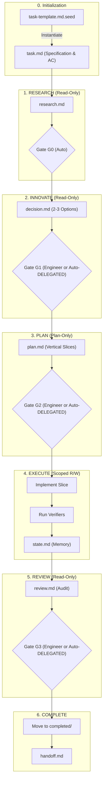

# Process & Task Orchestration (RIPER-5)

<process_orchestration version="3.0" framework="RIPER-5">

<overview>
  Standard template and operational control center for managing engineering tasks and coordinating AI agent execution in this subsystem. Each active task is a self-contained engineering workspace with a full RIPER-5 artifact chain.
</overview>

---

## 1. Directory Structure

```text
process/
├── README.md                         # Operational guide (this file)
├── .editorconfig                     # Unified format settings for markdown, tsv, json
├── _seeds/                           # Read-only archetype blueprints
│   ├── _GUIDE.md                     # Full catalog, artifact chain, and instantiation commands
│   ├── task-template.md.seed         # Master contract & RIPER state record
│   ├── context-group.md.seed         # Research phase artifact
│   ├── decision-template.md.seed     # Innovate phase artifact (Gate 1 memory)
│   ├── plan-template.md.seed         # Plan phase artifact (execution contract, Gate 2)
│   ├── state-template.md.seed        # Execute loop persistent memory
│   ├── review-template.md.seed       # Review phase artifact (Gate 3)
│   ├── handoff-template.md.seed      # Final projection (short)
│   ├── cancellation-template.md.seed # Knowledge-preserving cancellation record
│   ├── pause-template.md.seed        # Task pause & parking record (temporary blockages)
│   ├── results-template.tsv.seed     # Benchmark & quantitative metrics tracker
│   └── program-template.md.seed      # Multi-phase program blueprint
├── context/                          # Durable knowledge base & context routers
│   ├── all-context.md                # Root context router
│   ├── planning/all-planning.md      # Planning calibration & vertical slicing rules
│   └── tests/all-tests.md            # Testing pyramid, harness policy & mock conventions
├── development-protocols/            # System rules & execution harness
│   ├── all-development-protocols.md
│   ├── orchestration.md              # Subagent delegation rules
│   └── implementation-standards.md  # Typing, linting, and testing standards
├── features/                         # Domain features (≥5 files / ≥3 phases)
│                                     # Prompt keywords: "big task", "feature", "big changes", "epic"...
│   ├── active/                       # Active task workspaces: {CHG-ID}-{task-slug}/
│   │   └── CHG-XXX-example/          # One folder per task
│   │       ├── task.md               # Master contract & state record
│   │       ├── research.md           # Research phase output
│   │       ├── decision.md           # Innovate phase output
│   │       ├── plan.md               # Plan phase output
│   │       ├── state.md              # Execute loop memory
│   │       ├── review.md             # Review phase output
│   │       ├── handoff.md            # Final projection
│   │       ├── results.tsv           # (Optional) Benchmark & metric iteration tracking
│   │       ├── paused.md             # (If paused) Parking record & resumption criteria
│   │       └── cancelled.md          # (If aborted) Cancellation findings & rollback status
│   ├── completed/                    # Archived task workspaces
│   └── backlog/                      # Backlog notes: {note_slug}_NOTE_{dd-mm-yy}.md
└── general-plans/                    # Cross-cutting & standalone tasks (<5 files)
                                      # Prompt keywords: "small task", "general changes", "small changes", "bug fix"...
    ├── active/
    ├── completed/
    └── backlog/
```

---

## 2. RIPER-5 Artifact Chain & Workflow

Every task produces a sequential chain of artifacts. Create them progressively as the task advances:



```text
task.md          ← (always) Master contract, RIPER phase/gate state, AC, decisions
research.md      ← (Research) Execution flow, evidence, boundaries
decision.md      ← (Innovate) Options, trade-offs, Gate 1 (Engineer approval or Auto-DELEGATED)
plan.md          ← (Plan) Slices, verifiers, scope contract, Gate 2 (Engineer sign-off or Auto-DELEGATED)
state.md         ← (Execute) Per-slice progress, failure memory, retry budget
review.md        ← (Review) Findings, verification matrix, Gate 3 (PASS)
handoff.md       ← (Complete) Short final projection
```

### Task Initialization: Prompt-Driven vs Manual

Users can initiate tasks through two methods:
1. **Prompt & Slash Command Initialization (Recommended):** Provide your task requirements directly in the prompt using pseudo-slash commands or natural keywords. The Agent automatically scaffolds the workspace under `active/`, instantiates `task-template.md.seed` $\rightarrow$ `task.md`, hydrates specification tags, and immediately kicks off `RESEARCH`:
   - **`process/features/active/{task-slug}/`**: Triggered by commands `/feature`, `/big-task`, `/epic` or keywords `big task`, `feature`, `big changes`. For large, domain-specific features (≥5 files, multiple phases).
   - **`process/general-plans/active/{task-slug}/`**: Triggered by commands `/task`, `/small-task`, `/bug`, `/quick-fix` or keywords `small task`, `general changes`, `small changes`. For standalone tasks and quick fixes (<5 files).
   - **Special Commands**: `/hotfix` (emergency bugfix, runs in DELEGATED mode), `/fast-track` (runs autonomously across all phases).
2. **Manual Terminal Setup:** Manually run `mkdir -p process/.../active/{slug}` and `cp process/_seeds/task-template.md.seed process/.../active/{slug}/task.md` before prompting the Agent.

### Concept → Artifact mapping

| Concept | Artifact |
|---|---|
| Task / Spec | `task.md` |
| Research / Context | `research.md` |
| Innovate / Decision | `decision.md` |
| Plan | `plan.md` |
| Loop state | `state.md` |
| Execute | source code + tests + `state.md` |
| Review | `review.md` |
| Handoff | `handoff.md` |
| Pause / Park | `paused.md` (clean freeze & resumption criteria upon temporary block) |
| Cancellation | `cancelled.md` (knowledge preservation upon abort) |
| Benchmark / Metrics | `results.tsv` (performance and eval metrics) |
| Program | `program.md` (multi-phase umbrella epic blueprint) |
| Gate 1 | `decision.md` approval |
| Gate 2 | `plan.md` approval |
| Gate 3 | `review.md` approval |
| Harness / Policy | `AGENTS.md` + `development-protocols/` |

---

## 3. RIPER-5 Operational Phases

<operational_phases>
  <phase order="1" name="Research">
    READ-ONLY. Ingest task spec; follow `<information_priority>`; produce `research.md`.
    Classify evidence: Confirmed / Observed / Hypothesized.
    Pass Research Exit Criteria (Gate 0) before advancing.
  </phase>

  <phase order="2" name="Innovate">
    READ-ONLY. Present 2–3 options with trade-off matrix.
    Produce `decision.md`. Gate 1: Engineer approves (PAIR mode) or Agent auto-certifies optimal recommendation [AUTO: DELEGATED] (DELEGATED/Fast-Track mode).
  </phase>

  <phase order="3" name="Plan">
    Plan artifacts only — no source changes.
    Decompose into vertical slices with verifiers, rollback points, and scope contract.
    Produce `plan.md`. Gate 2: Engineer approves (PAIR mode) or Agent auto-certifies scope contract [AUTO: DELEGATED] (DELEGATED/Fast-Track mode).
  </phase>

  <phase order="4" name="Execute">
    Read/write only within approved scope from `plan.md`.
    One slice at a time. Run verifier after each slice. Update `state.md` after each slice.
  </phase>

  <phase order="5" name="Review">
    READ-ONLY. May run verification commands. No code fixes.
    Produce `review.md` with findings. Gate 3 must pass before handoff. Under DELEGATED mode, Agent auto-completes housekeeping and creates `handoff.md`.
  </phase>
</operational_phases>

---

## 4. Template Architecture Philosophy: Understanding Why & How

To prevent mechanical, cargo-cult usage of the framework, the template architecture is engineered around the following core technical principles:

### 1. The Architectural "WHY" — Core Rationale
* **Why the `.seed` extension in `_seeds/`?**
  * Blueprint Immutability: The `.seed` suffix isolates master templates from standard AI discovery tools (`grep`, `find`), preventing agents from mistaking blueprints for active tasks and overwriting master templates.
* **Why separate phase-specific artifacts instead of one large Markdown file?**
  * Enforces Single Responsibility. Prevents oversized context windows (Anti-Context Saturation) that trigger hallucinations or rule neglect (Lost in the Middle). Ensures every Quality Gate (G1, G2, G3) maps to an auditable, physical file on disk.
* **Why split `features/` vs `general-plans/`?**
  * Blast Radius Separation: `features/` handles large, multi-phase epics (≥5 files or domain subsystems), whereas `general-plans/` houses rapid bugfixes and optimizations (<5 files). This keeps your workspace organized and prevents minor fixes from burying major architecture.
* **Why use the 3-state pipeline (`active/`, `backlog/`, `completed/`)?**
  * Filesystem State Machine: `active/` contains strictly one in-flight task at any time, maintaining zero context bleeding. `completed/` serves as a permanent historical archive for future tasks to reference via `<context_references>`.
* **Why pseudo-XML tags (`<goal>`, `<allowed_files>`,...)?**
  * Machine-Readable Contract: Enforces unambiguous semantic boundaries that LLMs parse reliably, strictly constraining AI write access.

### 2. The Operational "HOW" — Execution Principles
* **Prompt-Driven Task Initialization:** Eliminates the friction of running terminal commands or manual file copies. Users simply specify task prompts with keywords (`big task`, `feature`, `big changes` for `features/active/`; `small task`, `general changes`, `small changes` for `general-plans/active/`). The Agent detects the scope, scaffolds the folder, instantiates `task-template.md.seed`, populates `task.md`, and initiates execution immediately.
* **Copy-On-Demand:** Never bulk-copy all seeds into a task folder upfront. Start with `task.md`, then instantiate `research.md` $\rightarrow$ `decision.md` $\rightarrow$ `plan.md` $\rightarrow$ `state.md` $\rightarrow$ `review.md` $\rightarrow$ `handoff.md` sequentially as phases advance.
* **Stateless Chat, Stateful Workspace:** Sessions can reset and chats can close. All operational progress and error memory (`<failure_memory>`) are recorded on disk (`state.md`), allowing any new session to resume with 100% fidelity.
* **Selective Knowledge Crystallization:** Upon completion, summarize the task in `handoff.md`. Only promote reusable architectural standards or schema contracts into `process/context/` and `all-context.md`.

</process_orchestration>
